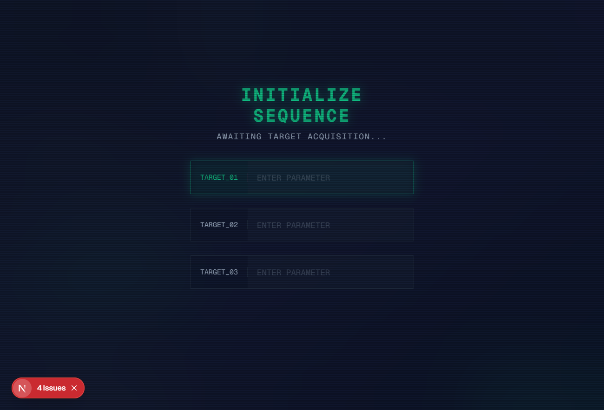
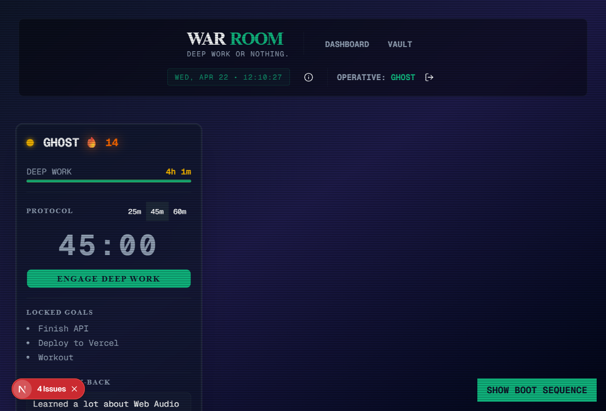

# ⚔️ War Room: The Command Center

 

---

## 📖 The Story: Deep Work or Nothing

Three B.Tech engineers. 50 days of summer vacation. The monumental bridge from Step 1 to Step 40 of placement prep. 

We realized early on that standard productivity apps and generic Pomodoro timers were entirely too "soft." They are solitary, uninspiring, and easily ignored. You set a timer, you fail to execute, and nobody knows. There are zero stakes.

We didn't need another app; we needed a **Command Center**. A brutal, industrial-grade accountability environment for an elite squad. An ecosystem that forces execution through public visibility. If you don't declare your daily targets, the system locks you out. If you fall below the 4-Hour Floor, you are thrown into the Red Zone for the team to see. No excuses. 

This is the War Room. Deep work or nothing.

---

## ⚡ Feature Breakdown

- **The Morning Lock-In (The Gatekeeper):** You cannot view the dashboard or interact with the system until you lock in your three critical targets for the day.
- **The 4-Hour Floor (The Red Zone):** A minimum threshold of execution. If an operative fails to achieve 4 hours of deep work, their status flashes red, visually marking them as underperforming.
- **The Knowledge Vault (Resources):** A centralized, shared repository for the squad to drop technical documentation, DSA solutions, and placement strategies. 
- **The 🔥 Streak System:** Automated daily Cron jobs (via Vercel) that calculate consecutive days of hitting the 4-Hour Floor, forging an unbreakable chain of momentum.

---

## 🏗️ Technical Architecture & File Anatomy

**Tech Stack**: Next.js 14 (App Router) • Supabase Realtime • Tailwind CSS • shadcn/ui

We designed the architecture to be as relentless as the methodology it enforces. Here is the anatomical breakdown of the core modules:

### `app/layout.tsx` 
**The Atmosphere Engine**  
Sets the visual "shell" of the application. It establishes the global typography (Geist Mono) and injects the persistent CRT scanline and grid pattern atmosphere, ensuring the operative immediately feels immersed in a high-stakes environment.

### `lib/sound.ts` 
**The Synthesis Layer**  
Instead of relying on heavy, bandwidth-hogging MP3 files, we utilized the native browser **Web Audio API**. This file generates mathematically precise synthesized oscillators—from the low 60Hz hum during the Boot Sequence to the crisp success chimes—resulting in zero storage footprint and zero latency.

### `components/dashboard/MorningLockInModal.tsx`
**The Gatekeeper Logic**  
The first line of defense. This component enforces the "Rule of Three" parameter input. It renders the high-blur frosted glass overlay and intercepts all dashboard interaction until the operative successfully initializes their daily sequence.

### `components/dashboard/RealtimeProvider.tsx` 
**The Ephemeral Broadcast Layer**  
The silent nervous system of the War Room. It utilizes Supabase Realtime Broadcasts to manage live status updates without hammering the Postgres database with writes. It acts as an ephemeral pub/sub layer, instantly transmitting an operative's active timer status (the glowing green LED) to the rest of the squad.

### `components/dashboard/DeepWorkTimer.tsx`
**The Execution Engine**  
The session-based execution engine dictating the protocols (25, 45, or 60 minutes). It interfaces directly with the `RealtimeProvider` to broadcast operational states and calculates the exact accumulation of deep work seconds before pushing the final telemetry to the database.

---

> *"Amateurs sit and wait for inspiration, the rest of us just get up and go to work."*  
> — Stephen King
